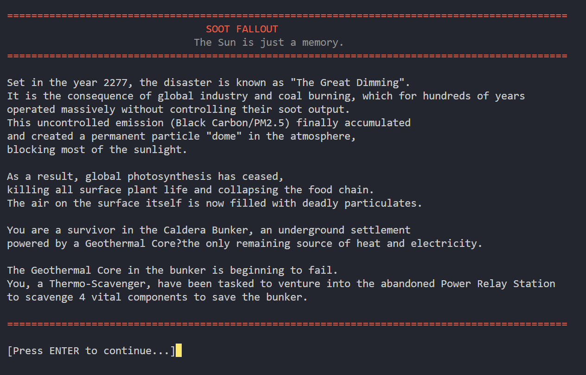
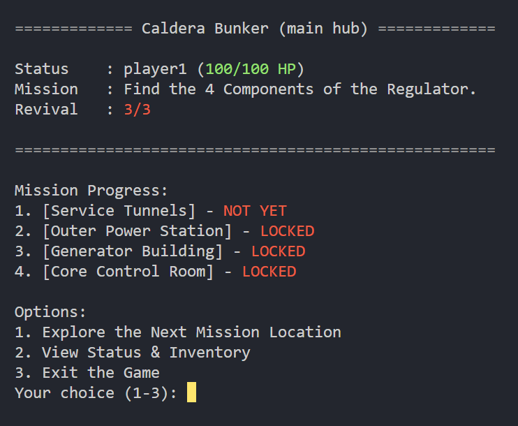
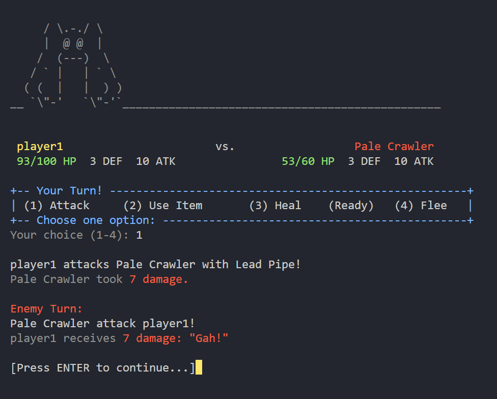
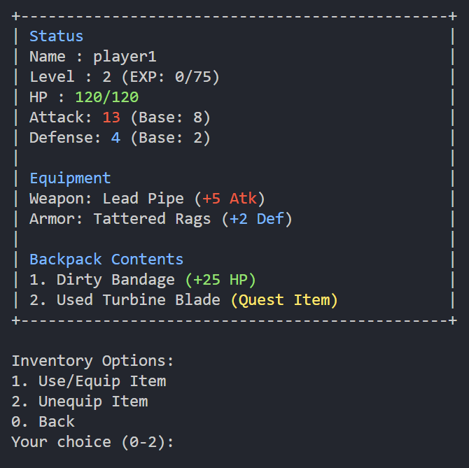
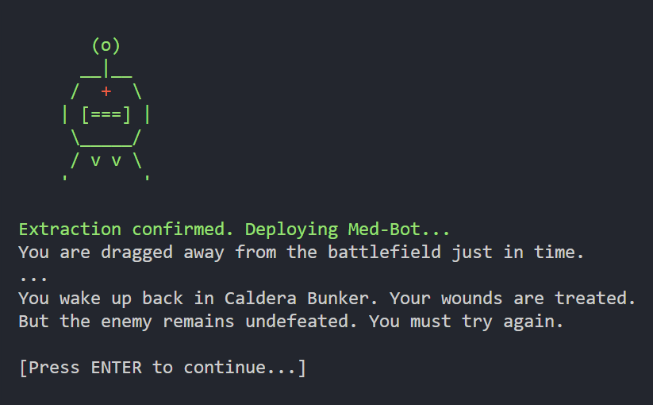
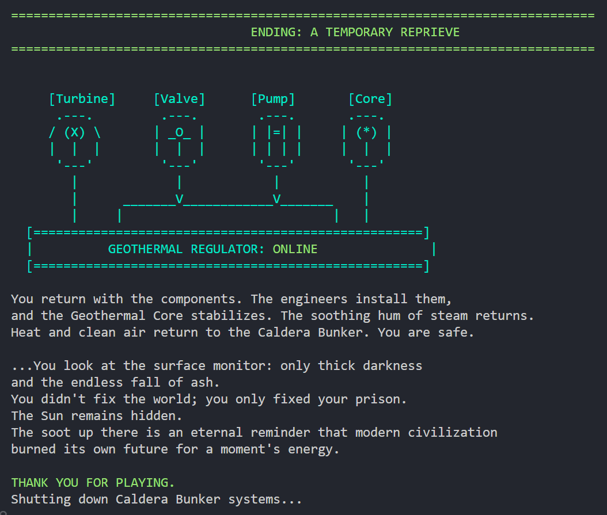
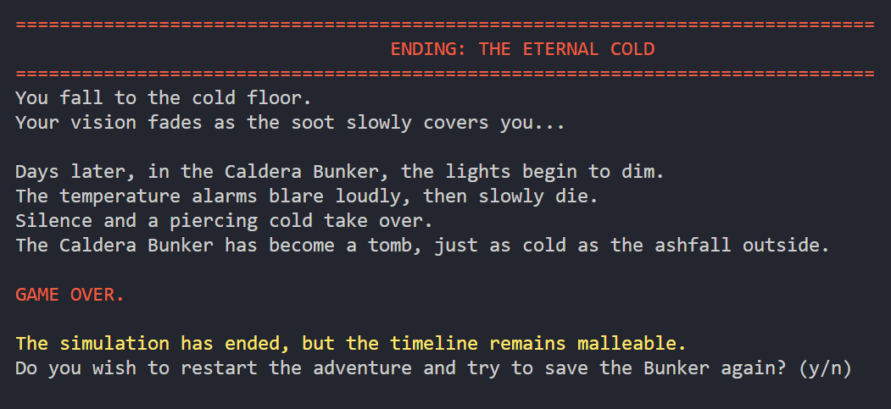
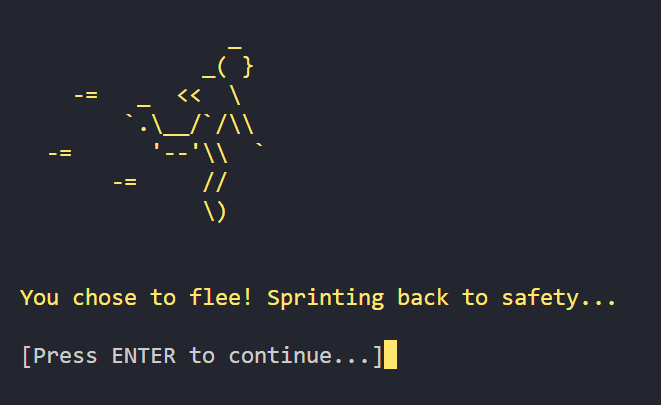

# Soot Fallout
> The Sunshine is just a memory.


---

## Latar Belakang & Plot

**Soot Fallout** adalah Mini RPG Game dengan gaya Turn Based yang berbasis konsol/CLI yang bertemakan *post-apocalypse*.
<!-- dan berakar pada realisme ilmiah -->

Berlatar pada tahun 2277, bencana ini dikenal sebagai "The Great Dimming". Suatu bentuk konsekuensi nyata dari aktivitas industri global dan pembakaran batu bara, yang selama ratusan tahun beroperasi secara masif tanpa mengendalikan keluaran jelaga mereka dan mengabaikan penggunaan energi alternatif/hijau terbarukan. Emisi tak terkendali (Karbon Hitam/PM2.5) ini akhirnya terakumulasi dan menciptakan "payung/kubah" partikel permanen di lapisan atmosfer, yang menghalangi sebagian besar sinar matahari. Akibatnya, proses fotosintesis global tidak lagi berjalan, membunuh semua tanaman di permukaan dan meruntuhkan rantai makanan. Udara di permukaan kini dipenuhi partikulat yang mematikan.

Manusia bertahan hidup di **Caldera Bunker**, sebuah pemukiman bawah tanah mandiri yang ditenagai oleh Inti Geotermal yang merupakan satu-satunya sumber panas dan listrik yang tersisa.

**Plot Utama:** Inti Geotermal di bunker mulai tidak berfungsi dengan semestinya. Anda, seorang `Thermo-Scavenger`, ditugaskan untuk melakukan perjalanan berbahaya ke "Stasiun Pembangkit Cadangan" yang terbengkalai untuk menjarah 4 komponen vital dan menyelamatkan bunker.

---

## Fitur Gameplay

* **RPG Berbasis Konsol:** Seluruh interaksi dilakukan melalui input teks (memilih opsi).
* **Pertarungan Turn-Based:** Sistem pertarungan taktis dengan 4 opsi: `Serang`, `Gunakan Item` (Hanya *Consumable*), `Heal` (Skill dengan *cooldown*), dan `Kabur`.
* **Alur Cerita Linear:** Alur cerita memiliki progres yang jelas (Mulai => Misi => Menang/Kalah).
* **Sistem Leveling Sederhana:** Mendapat EXP untuk naik level, meningkatkan HP dan Attack.
* **Inventory Fungsional:**
    * **Equip/Unequip:** Player dapat memakai (`Weapon`, `Armor`) dan melepas item.
    * **Stat Dinamis:** Status `totalAttack` dan `totalDefense` Player akan ter-update secara otomatis.
    * **Consumables:** Player dapat menggunakan item (seperti `Dirty Bandage`) untuk memulihkan HP.
* **Ending:** Permainan memiliki 2 akhir cerita (Menang/Kalah) berdasarkan keberhasilan misi.

---

## Persyaratan Sistem

Sebelum menjalankan permainan, pastikan komputer Anda telah memenuhi persyaratan berikut:

* **Java Development Kit (JDK):** Versi 11 atau lebih baru.
    * Cek versi dengan perintah: `java -version`
* **Sistem Operasi:** Windows, macOS, atau Linux.
    * *Catatan:* Pengalaman terbaik (visual warna & clear screen) dioptimalkan untuk Windows Terminal atau terminal berbasis Unix.

---
## Struktur Proyek

```
Soot-Fallout/
├── .gradle/               
├── build/                  
├── docs/
├── gradle/  
├── src/                   
│   ├── core/
│   │   └── GameManager.java
│   ├── models/
│   │   ├── items/
│   │   │   ├── Item.java (Abstract)
│   │   │   ├── Weapon.java
│   │   │   ├── Armor.java
│   │   │   ├── Consumable.java
│   │   │   └── QuestItem.java
│   │   ├── monsters/
│   │   │   ├── Monster.java
│   │   │   └── BossMonster.java
│   │   ├── Entity.java (Abstract)
│   │   └── Player.java
│   └── utils/
│       ├── AsciiArt.java
│       ├── ConsoleUtils.java
│       ├── InputHandler.java
│       ├── Language.java
│       └── Narrator.java
├── .gitattributes
├── .gitignore
├── build.gradle           
├── gradlew                 
├── gradlew.bat             
├── run.bat        
├── run.sh        
├── settings.gradle        
├── soot-fallout.exe        
└── README.md
```
---

## Panduan Instalasi & Eksekusi

Silakan pilih metode yang sesuai dengan kebutuhan Anda.

### A. Sebagai Pemain (jika menggunakan windows)
Jika Anda menerima game ini dalam bentuk file `.exe` atau folder distribusi:

1.  Buka folder `SootFallout` (atau folder hasil ekstrak).
2.  Cari file bernama **`SootFallout.exe`**.
3.  **Klik dua kali (Double-click)** file tersebut.
4.  Game akan langsung berjalan di jendela konsol baru.

### B. Metode Alternatif (Semua OS)
Jika file `.exe` tidak berjalan atau Anda menggunakan macOS/Linux, gunakan *script* peluncur yang tersedia. Metode ini memastikan fitur visual seperti pembersihan layar (*clear console*) berfungsi optimal.

1.  Buka terminal atau Command Prompt di dalam folder proyek `SootFallout`.
2.  Jalankan perintah berikut:

    **Untuk Pengguna Windows:**
    ```cmd
    .\run.bat
    ```

    **Untuk Pengguna macOS/Linux:**
    ```bash
    ./run.sh
    ```

### C. Mode Pengembang (Development)
Jika Anda ingin memodifikasi kode atau melakukan *build* ulang proyek menggunakan Gradle:

1.  **Membuat Ulang File .exe:**
    ```bash
    ./gradlew createExe
    ```
    File hasil akan berada di: `build/launch4j/SootFallout.exe`.
    <!-- > **Catatan Distribusi:** Jika ingin membagikan game ini ke teman, pastikan Anda men-ZIP seluruh isi folder `build/launch4j/` (termasuk folder `lib` jika ada), bukan hanya file `.exe`-nya saja. -->

2.  **Membersihkan Project (Clean Build):**
    ```bash
    ./gradlew clean
    ```
---

## Gameplay Capture

### Prolog
Prolog dan latar belakang cerita dalam game



### Menu Utama & Status
Pusat navigasi pemain (*Hub*). Menampilkan status karakter, misi, dan progres monster yang telah dikalahkan.



### Sistem Pertarungan (Battle System)
Tampilan antarmuka pertarungan *turn-based* dengan visualisasi ASCII Art monster dan statistik atribut.



### Manajemen Inventaris
Pemain dapat mengganti peralatan (*Equip*) atau menggunakan item penyembuh (*Consumable*).



### Mekanisme Med-Bot (Revive)
Saat HP mencapai 0, pemain memiliki kesempatan memanggil bantuan medis (terbatas 3x).



### Ending Permainan
Contoh tampilan salah satu kondisi akhir permainan (Menang/Kalah).

Win Ending (jika menyelesaikan semua misi dan mengalahkan boss terakhir):



Lose Ending (jika kalah dari musuh dan kesempatan revive 3x telah habis digunakan, atau memilih menyerah):



---

## Strategi & Tips Bertahan Hidup


*Soot Fallout* dirancang dengan tingkat kesulitan yang menantang. Berikut adalah tips dari pengembang untuk membantu Anda menyelesaikan misi:

### 1. Manajemen Equipment adalah Kunci
Jangan abaikan item yang dijatuhkan (*drop*) oleh musuh!
* Musuh di tahap awal (seperti *Pale Crawler atau Soot-lung Scavenger*) sering menjatuhkan senjata atau armor yang lebih kuat dari perlengkapan awal Anda.
* Segera buka inventaris dan pilih **Equip** setelah mendapatkan *loot* baru untuk meningkatkan **Attack** dan **Defense** Anda sebelum melawan Boss.

### 2. Gunakan Skill Heal dengan Bijak
Karakter Anda memiliki *skill* **Heal** yang kuat, namun memiliki kelemahan:
* **Cooldown 3 Giliran:** Anda tidak bisa menggunakannya berturut-turut.
* **Strategi:** Jangan menunggu sampai HP kritis (sekarat) untuk melakukan *Heal*. Gunakan *skill* ini saat HP Anda turun sekitar 30-40% untuk menjaga kondisi tetap prima, karena Anda harus bertahan 3 giliran berikutnya tanpa *heal* gratis.

### 3. Jangan Malu untuk Kabur (Flee)



Jika Anda salah perhitungan—misalnya lupa memakai *armor* baru atau kehabisan *potion* di tengah pertarungan Boss—jangan memaksakan diri sampai mati.
* Pilih opsi **4. Flee (Kabur)**.
* **Konsekuensi:** Anda akan kembali ke bunker dan HP musuh akan *reset* penuh.
* **Keuntungan:** Anda selamat, HP Anda pulih, dan Anda bisa mengatur ulang strategi/inventaris sebelum mencoba menantang musuh itu lagi. Ini jauh lebih baik daripada mati dan mengurangi kuota *Med-Bot*.

---

## Tim Pengembang (Contributors)

| No. | Nama | NRP | GitHub |
| :--- | :--- | :--- | :--- |
| 1. | Randy Harkediansa Jufri | 3124510075 | [@randyhj](https://github.com/harked) |
| 2. | Hesa Firdaus | 3124510076 | [@hesa20](https://github.com/hesa20) |
| 3. | Kalsa Syaqila | 3124510077 | [@kalsa64](https://github.com/kalsa64) |
| 4. | Abdul Aziz | 3124510078 | [@abaz1d](https://github.com/abaz1d) |
| 5. | Muhammad Adhim Niokagi | 3124510109 | [@niokagi](https://github.com/niokagi) |
